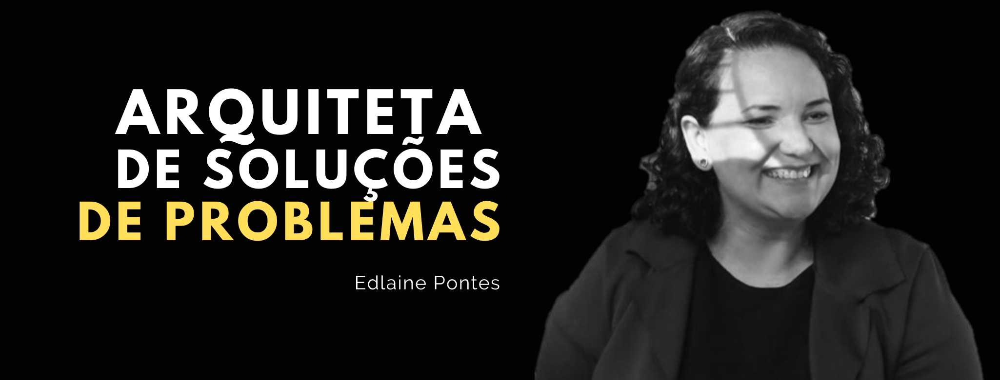

<h1 align="center">
    
</h1>

<h2> Edlaine Pontes </h2>

### 🚀 Sobre

Sou apaixonada por usar a tecnologia para criar soluções para as pessoas, muitas vezes soluções simples causam um impacto muito grande no trabalho de outras pessoas.
Atuei por 10 anos em Recursos Humanos e ao longo de minha trajetória profissional me tornei especialista em resolver problemas: gestão de conflitos, redução de turnover, desenvolvimento de líderes e otimização de processos.

Me aproximei da tecnologia me tornando responsável por implantação e parametrização de sistemas de RH (ADP, Questor, Microsiga e SAP) e otimizando tarefas com Python.

Adoro desafios, e busco sempre ampliar minha compreensão de como a tecnologia pode servir o ser humano, para tomar decisões mais assertivas na execução de qualquer projeto então compreendi que era hora de mudar de carreira e usar minha expertise em Gestão de Pessoas para me tornar uma Desenvolvedora.

Atualmente sou aluna da turma de **back-end** da **Reprograma**.

Sou mae, completamente apaixonada por 📚 e amo viajar. 

#### Redes Sociais

▶ linkedin: https://www.linkedin.com/in/edlaine-pontes/

▶Github: https://github.com/Edlaine-Pontes
